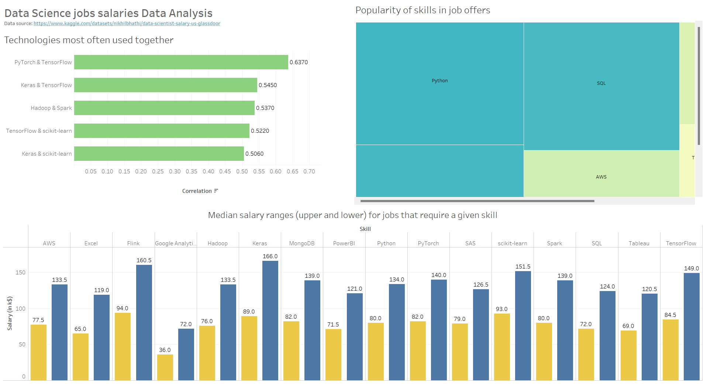

# Data-Science-Salaries-Data-Analysis

The project is aimed at the analysis and visualization of data related to the earnings of Data Scientists. I used the dataset from kaggle, explored it and cleaned it from duplicates. Finally I created a dashboard in Tableau.

Overview of the dashboard:

Links:

- [Dashboard](https://public.tableau.com/app/profile/franciszek.sali.ski/viz/DataSciencejobssalariesanalysis/Dashboard1)
- [Source of data](https://www.kaggle.com/datasets/nikhilbhathi/data-scientist-salary-us-glassdoor)
